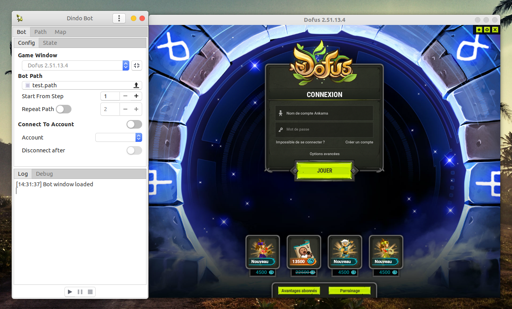

#  Dindo Bot

[](https://www.python.org/)
[](https://www.gtk.org/)
[](https://www.ubuntu.com/download/desktop)

Farming bot for Dofus game which uses your mouse, keyboard & screen pixels to interact with the game client.



## Features

- **Easy control**: play, pause/resume or stop the bot like if you were using your favorite music player.
- **Smart bot**: Dindo-bot knows when your connection turns off and will wait for it to get back before proceeding or will automatically pause itself if it takes a long time.
- **Multi accounts management**: you don't have to worry about switching between your accounts, Dindo-bot can handle that for you :wink:.
- **Integrated Path & Maps builder**: easily create your own custom paths & farming maps.
- **Keyboard shortcuts**.

## Use Cases

- Auto-connect to your Dofus account(s).
- Move around the map & save time for long dungeon paths, [paths](paths) pull requests are welcome :pray:.
- Farming & jobs (:construction: this part still needs to be improved, also, the bot cannot handle fights yet :warning:).
- Automated actions like flood :speech_balloon:.

## Installation

First, you need to install some dependencies using one of the following commands:

**Debian & derivatives:**
```bash
sudo apt install python-gi gir1.2-gtk-3.0 gir1.2-wnck-3.0 python-xlib python-pil
```

**Arch Linux & derivatives:**
```bash
sudo pacman -S python-gobject gtk3 libwnck3 python-xlib python-pillow
```

Then, clone this repository using git or just [download](https://github.com/AXeL-dev/Dindo-Bot/archive/master.zip) & unzip it:
```bash
git clone https://github.com/AXeL-dev/Dindo-Bot.git
```

To run the bot open a terminal & type:
```bash
cd /path/to/bot
python bot.py
```

You could even run the bot in developer mode (which brings some additional features):
```bash
python bot.py --dev
```

**Note:** the [desktop file](dindo-bot.desktop) can also be used to run the bot with a double-click.

## To Know

- You cannot use your computer for something else while Dindo-bot is running.
- Since the bot simulates normal human behavior, you have less chances to get spotted by the Anti-bot (less is not 0).
> Tips: For more safety, try changing bot paths from time to time.
- The main goal of this bot is to simplify repetitive tasks and reduce boredom during your gameplay.
- We do not encourage multi-boting and do not support it anyway (it destroys the server economy :grimacing:).
- Windows & Mac OS are not ~~yet~~ supported [#1](https://github.com/AXeL-dev/Dindo-Bot/issues/1).

## License

Dindo-bot is licensed under the [MIT](LICENSE) license.
